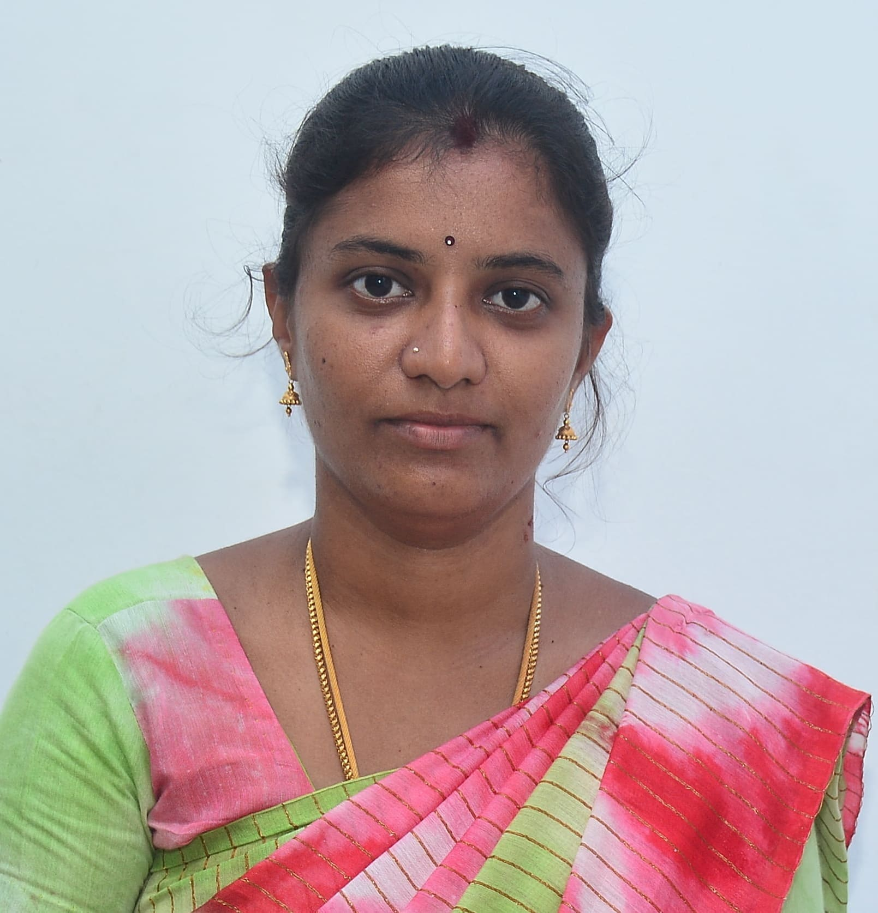
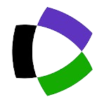

<html lang="en">
<head>
  <meta charset="UTF-8">
  <meta name="viewport" content="width=device-width, initial-scale=1.0">
  <title>Dr. P. Avudai Selvi - Assistant Professor of Mathematics</title>
  <meta name="description" content="Dr. P. Avudai Selvi, Assistant Professor of Mathematics at V.O. Chidambaram College, Thoothukudi. Research in Singularly Perturbed Problems, Delay Differential Equations, and Numerical Analysis.">
  <meta name="author" content="Dr. P. Avudai Selvi">

<link rel="icon" type="image/png" href="favicon.png">

  <link rel="preconnect" href="https://fonts.googleapis.com">
  <link rel="preconnect" href="https://fonts.gstatic.com" crossorigin>
  <link href="https://fonts.googleapis.com/css2?family=Inter:wght@300;400;500;600;700;800&family=Playfair+Display:ital,wght@0,400;0,500;0,600;0,700;1,400;1,500&display=swap" rel="stylesheet">
  
  
  
  
  
  
  
</head>
<body class="bg-stone-50 text-black antialiased overflow-x-hidden">

<!-- ========== NAV ========== -->
<nav id="nav" class="fixed top-0 left-0 w-full z-50 bg-indigo-950/90 backdrop-blur-md border-b border-white/10 no-print">
  

    <a href="#hero" class="flex items-center gap-2.5">

  

      Dr. P. Avudai Selvi
    </a>
    

      <a href="#education" class="nav-link text-indigo-300 hover:text-indigo-100 text-xs font-medium transition-colors">Education</a>
      <a href="#research" class="nav-link text-indigo-300 hover:text-indigo-100 text-xs font-medium transition-colors">Research</a>
      <a href="#publications" class="nav-link text-indigo-300 hover:text-indigo-100 text-xs font-medium transition-colors">Publications</a>
      <a href="#teaching" class="nav-link text-indigo-300 hover:text-indigo-100 text-xs font-medium transition-colors">Teaching</a>
      <a href="#swayam-nptel" class="nav-link text-indigo-300 hover:text-indigo-100 text-xs font-medium transition-colors">SWAYAM-NPTEL</a>
      <a href="#engagement" class="nav-link text-indigo-300 hover:text-indigo-100 text-xs font-medium transition-colors">Engagement</a>
      <a href="#contact" class="bg-indigo-400 hover:bg-indigo-300 text-indigo-950 text-xs font-semibold px-4 py-2 rounded-full transition-colors">Contact</a>
    

    <button id="mobBtn" class="lg:hidden text-white w-9 h-9 flex items-center justify-center"><iconify-icon icon="lucide:menu" width="20"></iconify-icon></button>
  

</nav>

<!-- Mobile Menu -->

  

    Menu
    <button id="mobClose" class="text-white w-9 h-9 flex items-center justify-center"><iconify-icon icon="lucide:x" width="20"></iconify-icon></button>
  

  

    <a href="#education" class="ml text-2xl font-serif text-white/80 hover:text-indigo-300 transition-colors">Education</a>
    <a href="#research" class="ml text-2xl font-serif text-white/80 hover:text-indigo-300 transition-colors">Research</a>
    <a href="#publications" class="ml text-2xl font-serif text-white/80 hover:text-indigo-300 transition-colors">Publications</a>
    <a href="#teaching" class="ml text-2xl font-serif text-white/80 hover:text-indigo-300 transition-colors">Teaching</a>
    <a href="#swayam-nptel" class="ml text-2xl font-serif text-white/80 hover:text-indigo-300 transition-colors">SWAYAM-NPTEL</a>
    <a href="#engagement" class="ml text-2xl font-serif text-white/80 hover:text-indigo-300 transition-colors">Engagement</a>
    <a href="#contact" class="ml text-2xl font-serif text-white/80 hover:text-indigo-300 transition-colors">Contact</a>
  

<!-- ========== HERO ========== -->
<section id="hero" class="brochure-hero relative min-h-screen flex items-center bg-indigo-950 overflow-hidden">
  ∫
  Σ
  ∇
  ∞
  π
  λ
  Δ
  

    
    

    

  

  

    

      

        
<iconify-icon icon="lucide:graduation-cap" width="11"></iconify-icon>Department of Mathematics

        <h1 class="ri font-serif text-white text-4xl md:text-5xl lg:text-6xl font-normal tracking-tight leading-[1.08] mb-2">Dr. P. Avudai Selvi</h1>
        
Assistant Professor Department of Mathematics V. O. Chidambaram College, Thoothukudi Affiliated to Manonmaniam Sundaranar University, Tamil Nadu

        

          <iconify-icon icon="lucide:award" width="11"></iconify-icon>CSIR-NET Qualified
          <iconify-icon icon="lucide:trophy" width="11"></iconify-icon>GATE 2013 - AIR 312
          <iconify-icon icon="lucide:medal" width="11"></iconify-icon>University First Rank
        

        

          <a href="#research" class="inline-flex items-center gap-2 bg-indigo-400 hover:bg-indigo-300 text-indigo-950 text-xs font-semibold px-6 py-3 rounded-full transition-all duration-300 hover:shadow-lg hover:shadow-indigo-400/20">View Research <iconify-icon icon="lucide:arrow-right" width="14"></iconify-icon></a>
          <a href="mailto:avudaiselvi12@gmail.com" class="inline-flex items-center gap-2 bg-white/5 hover:bg-white/10 border border-white/10 text-white text-xs font-medium px-6 py-3 rounded-full transition-all"><iconify-icon icon="lucide:mail" width="14"></iconify-icon>Email Me</a>
        

        

          

4

Papers

          

100

Citations

          

3

h-index

          

312

GATE Rank

        

      

      

        

          

            

           

  

              
Dr. P. Avudai Selvi

              
Assistant Professor of Mathematics

              
PhD · CSIR-NET · GATE

            

  
  <!-- Google Scholar -->
  <a href="https://scholar.google.com/citations?user=jhWKoboAAAAJ&hl=en&oi=ao" target="_blank"
     class="w-9 h-9 rounded-full bg-white/5 border border-white/10 flex items-center justify-center hover:bg-white/10 transition-all">
    <iconify-icon icon="academicons:google-scholar" width="16" class="text-indigo-300"></iconify-icon>
  </a>

  <!-- LinkedIn -->
  <a href="https://in.linkedin.com/in/avudai-selvi-periyasamy-500b9678" target="_blank"
     class="w-9 h-9 rounded-full bg-white/5 border border-white/10 flex items-center justify-center hover:bg-white/10 transition-all">
    <iconify-icon icon="mdi:linkedin" width="16" class="text-indigo-300"></iconify-icon>
  </a>

  <!-- ResearchGate -->
  <a href="https://www.researchgate.net/profile/Periyasamy-Avudai-Selvi" target="_blank"
     class="w-9 h-9 rounded-full bg-white/5 border border-white/10 flex items-center justify-center hover:bg-white/10 transition-all">
    <iconify-icon icon="academicons:researchgate" width="16" class="text-indigo-300"></iconify-icon>
  </a>

  <!-- ORCID -->
  <a href="https://orcid.org/0000-0002-6774-9062" target="_blank"
     class="w-9 h-9 rounded-full bg-white/5 border border-white/10 flex items-center justify-center hover:bg-white/10 transition-all">
    <iconify-icon icon="academicons:orcid" width="16" class="text-indigo-300"></iconify-icon>
  </a>

 <!-- Vidwan -->  
  <a href="https://vidwan.inflibnet.ac.in/profile/398007" target="_blank"
     class="w-9 h-9 rounded-full bg-white/5 border border-white/10 flex items-center justify-center hover:bg-white/10 transition-all">
    <iconify-icon icon="lucide:book-marked" width="16" class="text-indigo-300"></iconify-icon>
  </a>

  <!-- Publons -->
  

            

          

          

            
Thesis

            
Numerical  Methods  for  Singularly  Perturbed  Delay  Differential  Equations

          

        

      

    

  

  

    Scroll
    

  

</section>

<!-- ========== EDUCATION ========== -->
<section id="education" class="py-20 md:py-28 bg-white">
  

    

      

        01 — Education & Awards
        <h2 class="font-serif text-3xl md:text-4xl tracking-tight text-black leading-snug">Academic Journey</h2>
      

      

        <!-- Education Timeline -->
        

          

            

            

PhD in Mathematics2013 – 2018

Department of Mathematic, Bharathidasan University, Tiruchirappalli

Thesis: Numerical Methods for Singularly Perturbed Delay Differential Equations

Supervisor: Dr. N. Ramanujam

          

          

            

            

MSc Mathematics2011 – 2013CGPA 9.37

Department of Mathematic, Bharathidasan University, Tiruchirappalli

          

          

            

            

BSc Mathematics2008 – 2011CGPA 8.05

Seethalakshmi Ramaswami College (Autonomous), Tiruchirappalli

          

          

            

            

Higher Secondary2006 – 2008

St. Philomena's Girls Higher Secondary School, Tiruchirappalli

          

        

        <!-- Awards -->
        

          <h3 class="text-[10px] font-bold uppercase tracking-[0.2em] text-indigo-900 mb-5">Fellowships & Awards</h3>
          

            

              
<iconify-icon icon="lucide:trophy" width="14" class="text-amber-600"></iconify-icon>University First Rank

              
MSc Mathematics (2011 – 2013), Bharathidasan University

              
🏆 Education Minister Thiru C. Aranganayagam Gold Medal

              
🏆 Prof. N. Ramabhadran Gold Medal

            

            

              
<iconify-icon icon="lucide:bar-chart-3" width="14" class="text-indigo-600"></iconify-icon>GATE 2013

              
All India Rank <strong class="text-indigo-700">312</strong> in Mathematical Sciences

            

            

              
<iconify-icon icon="lucide:flask-conical" width="14" class="text-indigo-600"></iconify-icon>INSPIRE SRF

              
DST, New Delhi · Feb 2016 – Jul 2017

            

            

              
<iconify-icon icon="lucide:flask-conical" width="14" class="text-indigo-600"></iconify-icon>INSPIRE JRF

              
DST, New Delhi · Feb 2014 – Feb 2016

            

            

              
<iconify-icon icon="lucide:badge-check" width="14" class="text-green-600"></iconify-icon>CSIR & UGC NET

              
JRF & Eligibility for Lectureship in Mathematical Sciences — Jun & Dec 2014, Jun 2015

            

          

        

      

    

  

</section>

<!-- ========== RESEARCH ========== -->
<section id="research" class="py-20 md:py-28 bg-stone-50">
  

    

      02 — Research
      <h2 class="font-serif text-3xl md:text-4xl tracking-tight text-black">Areas of Specialization </h2>
    

    

      

        

        
ε

        <h3 class="text-base font-semibold text-black tracking-tight mb-2">Singularly Perturbed Problems</h3>
        
Numerical methods for boundary layer problems, parameter-uniform schemes, and Shishkin meshes for singularly perturbed differential equations.

      

      

        

        
τ

        <h3 class="text-base font-semibold text-black tracking-tight mb-2">Delay Differential Equations</h3>
        
Numerical treatment of delay differential equations with singular perturbations, including parabolic and reaction-diffusion type with shifts.

      

      

        

        
Δ

        <h3 class="text-base font-semibold text-black tracking-tight mb-2">Numerical Analysis</h3>
        
Finite difference methods, iterative schemes, convergence analysis, and error estimates for systems of differential equations.

      

    

    <!-- Research IDs -->
    

      <a href="https://www.researchgate.net/profile/Periyasamy-Avudai-Selvi" target="_blank" class="inline-flex items-center gap-2 bg-white border border-stone-200 rounded-lg px-4 py-2 text-xs font-medium text-stone-600 hover:border-indigo-200 transition-colors"><iconify-icon icon="academicons:researchgate" width="14" class="text-indigo-500"></iconify-icon>ResearchGate</a>
      <a href="https://orcid.org/0000-0002-6774-9062" target="_blank" class="inline-flex items-center gap-2 bg-white border border-stone-200 rounded-lg px-4 py-2 text-xs font-medium text-stone-600 hover:border-indigo-200 transition-colors"><iconify-icon icon="academicons:orcid" width="14" class="text-green-600"></iconify-icon>ORCID: 0000-0002-6774-9062</a>
      <a href="https://vidwan.inflibnet.ac.in/profile/398007" target="_blank" class="inline-flex items-center gap-2 bg-white border border-stone-200 rounded-lg px-4 py-2 text-xs font-medium text-stone-600 hover:border-indigo-200 transition-colors"><iconify-icon icon="lucide:book-marked" width="14" class="text-indigo-500"></iconify-icon>Vidwan: 398007</a>
      <a href="https://www.webofscience.com/wos/author/record/IUQ-3402-2023" target="_blank" class="inline-flex items-center gap-2 bg-white border border-stone-200 rounded-lg px-4 py-2 text-xs font-medium text-stone-600 hover:border-indigo-200 transition-colors"><iconify-icon icon="lucide:badge-check" width="14" class="text-indigo-500"></iconify-icon>Web of Science: IUQ-3402-2023</a>
    

  

</section>

<!-- ========== PUBLICATIONS ========== -->
<section id="publications" class="py-20 md:py-28 bg-white">
  

    

      03 — Publications
      <h2 class="font-serif text-3xl md:text-4xl tracking-tight text-black">Research Papers</h2>
    

    

  

</section>

<!-- ========== TEACHING ========== -->
<section id="teaching" class="py-20 md:py-28 bg-stone-50">
  

    

      04 — Teaching
      <h2 class="font-serif text-3xl md:text-4xl tracking-tight text-black">Courses & Mentoring</h2>
    

    

      <!-- Current Courses -->
      

        
<iconify-icon icon="lucide:book-open" width="16" class="text-indigo-600"></iconify-icon><h3 class="text-sm font-semibold text-black">Current Courses (2025–26)</h3>

        

          

Real Analysis I

I MSc · 6 hrs/week

          

Abstract Algebra

III BSc · 5 hrs/week

          

Naan Mudhalvan AI Skills

II BSc · 2 hrs/week

        

      

      <!-- Past Courses Summary -->
      

        
<iconify-icon icon="lucide:archive" width="16" class="text-indigo-600"></iconify-icon><h3 class="text-sm font-semibold text-black">Courses Taught</h3>

        

          
Complex AnalysisII MSc

          
Real Analysis III MSc

          
Algebraic StructuresI MSc

          
Linear AlgebraIII BSc

          
Advanced CalculusI MSc

          
Number TheoryIII BSc

          
Sequences & SeriesII BSc

          
GeoGebraII BSc

          
LaTeX I BSc

          
Probability TheoryII MSc

        

      

      <!-- MSc Projects -->
      

        
<iconify-icon icon="lucide:users" width="16" class="text-indigo-600"></iconify-icon><h3 class="text-sm font-semibold text-black">MSc Projects Guided</h3>

        

          

Meenachi Sundari S

A Study on Linear Algebra with Applications · 2025

          

Vemina V

Existence of Solution of Homogeneous Linear DE via Linear Algebra · 2025

          

Subhashini M

Numerical Methods for PDEs · 2024

          

Shalini M

Shortest Path Algorithms in OR · 2024

          

Priya M

Antimagic Labeling · 2024

        

      

    

    <!-- Services -->
    

      

        
<iconify-icon icon="lucide:file-edit" width="16" class="text-indigo-600"></iconify-icon><h3 class="text-sm font-semibold text-black">Question Paper Setting</h3>

        

          
Bharathidasan UniversityNov 2025, Apr 2025

          
St. Mary's College (Autonomous)Nov 2024, Nov 2025, Apr 2026

        

      

      

        
<iconify-icon icon="lucide:eye" width="16" class="text-indigo-600"></iconify-icon><h3 class="text-sm font-semibold text-black">External Examiner</h3>

        
A. P. C. Mahalaxmi College for Women, Thoothukudi — II B.Com, II BSc Mathematics (Naan Mudhalvan Digital Skills) · Oct 2025

      

    

  

</section>

<!-- ========== NPTEL ========== -->
<section id="swayam-nptel" class="py-20 md:py-28 bg-gradient-to-br from-indigo-950 via-indigo-900 to-indigo-950 relative overflow-hidden">
  ★
  ★
  

    

      05 — SWAYAM-NPTEL Excellence
      <h2 class="font-serif text-3xl md:text-4xl tracking-tight text-white">SWAYAM-NPTEL Achievements</h2>
      
Elite + Gold in every course completed

    

    

      <!-- Course 1 -->
      

        
★ Topper

        
Jul – Sep 2025

        <h3 class="text-white font-semibold text-sm mb-2 leading-snug">Introduction to Abstract and Linear Algebra</h3>
        
Prof. S. Mukhopadhyay, IIT Kharagpur · AICTE FDP · 8 weeks

        

          

100%

Score

          

Top 1%

Rank

          

332

Certified

        

        
Elite + GoldFDP Certificate

      

      <!-- Course 2 -->
      

        
★ Topper

        
Jul – Sep 2025

        <h3 class="text-white font-semibold text-sm mb-2 leading-snug">Point Set Topology</h3>
        
Prof. R. Sebastian, IIT Bombay · AICTE FDP · 8 weeks

        

          

94%

Score

          

Top

Rank

          

23

Certified

        

        
Elite + GoldFDP Certificate

      

      <!-- Course 3 -->
      

        
★ Topper

        
Jul – Oct 2024

        <h3 class="text-white font-semibold text-sm mb-2 leading-snug">Introductory Course in Real Analysis</h3>
        
Prof. P. D. Srivastava, IIT Kharagpur · AICTE FDP · 12 weeks

        

          

97%

Score

          

Top

Rank

          

48

Certified

        

        
Elite + GoldFDP Certificate

      

    

    <!-- Ongoing -->
    

      

        
<iconify-icon icon="lucide:loader" width="18" class="text-indigo-300 animate-spin"></iconify-icon>

        

          
Ongoing · Jan – Apr 2026

          
Numerical Analysis

          
Prof. S. Baskar, IIT Bombay · AICTE FDP · 12 weeks

        

      

    

  

</section>

<!-- ========== ACADEMIC ENGAGEMENT ========== -->
<section id="engagement" class="py-20 md:py-28 bg-white">
  

    

      06 — Engagement
      <h2 class="font-serif text-3xl md:text-4xl tracking-tight text-black">Academic contributions</h2>
    

    

      <!-- Events Organized -->
      

        <button class="coll-btn open w-full flex items-center justify-between p-5 text-left" data-target="eventsOrg">
          
<iconify-icon icon="lucide:calendar-plus" width="18" class="text-indigo-600"></iconify-icon>Events Organized5

          <iconify-icon icon="lucide:chevron-down" width="18" class="text-stone-400"></iconify-icon>
        </button>
        

          

        

      

      <!-- Lectures Delivered -->
      

        <button class="coll-btn w-full flex items-center justify-between p-5 text-left" data-target="lectDel">
          
<iconify-icon icon="lucide:mic" width="18" class="text-indigo-600"></iconify-icon>Lectures Delivered12

          <iconify-icon icon="lucide:chevron-down" width="18" class="text-stone-400"></iconify-icon>
        </button>
        

          

        

      

      <!-- Conferences Presented -->
      

        <button class="coll-btn w-full flex items-center justify-between p-5 text-left" data-target="confPres">
          
<iconify-icon icon="lucide:presentation" width="18" class="text-indigo-600"></iconify-icon>Papers Presented in Conferences4

          <iconify-icon icon="lucide:chevron-down" width="18" class="text-stone-400"></iconify-icon>
        </button>
        

          

        

      

      <!-- FDP Participation -->
      

        <button class="coll-btn w-full flex items-center justify-between p-5 text-left" data-target="fdpPart">
          
<iconify-icon icon="lucide:book-open-check" width="18" class="text-indigo-600"></iconify-icon>FDP / Conferences Attended17

          <iconify-icon icon="lucide:chevron-down" width="18" class="text-stone-400"></iconify-icon>
        </button>
        

          

        

      

      <!-- Additional Roles -->
      

        <button class="coll-btn w-full flex items-center justify-between p-5 text-left" data-target="addRoles">
          
<iconify-icon icon="lucide:shield-check" width="18" class="text-indigo-600"></iconify-icon>Additional Roles & Responsibilities4

          <iconify-icon icon="lucide:chevron-down" width="18" class="text-stone-400"></iconify-icon>
        </button>
        

          

        

      

      <!-- Work Experience -->
      

        <button class="coll-btn w-full flex items-center justify-between p-5 text-left" data-target="workExp">
          
<iconify-icon icon="lucide:briefcase" width="18" class="text-indigo-600"></iconify-icon>Work Experience3

          <iconify-icon icon="lucide:chevron-down" width="18" class="text-stone-400"></iconify-icon>
        </button>
        

          

        

      

    

  

</section>

<!-- ========== CONTACT ========== -->
<section id="contact" class="py-20 md:py-28 bg-stone-50">
  

    

      07 — Contact
      <h2 class="font-serif text-3xl md:text-4xl tracking-tight text-black">Get in touch</h2>
    

    

      

        

          <a href="mailto:avudaiselvi12@gmail.com" class="flex items-center gap-3 p-4 bg-indigo-50 rounded-xl hover:bg-indigo-100 transition-colors group">
            
<iconify-icon icon="lucide:mail" width="16" class="text-indigo-600"></iconify-icon>

            

Personal

avudaiselvi12@gmail.com

          </a>
          <a href="mailto:selvi.mat@voccollege.ac.in" class="flex items-center gap-3 p-4 bg-indigo-50 rounded-xl hover:bg-indigo-100 transition-colors group">
            
<iconify-icon icon="lucide:building" width="16" class="text-indigo-600"></iconify-icon>

            

College

selvi.mat@voccollege.ac.in

          </a>
          <a href="tel:+918825844369" class="flex items-center gap-3 p-4 bg-stone-50 rounded-xl hover:bg-stone-100 transition-colors group">
            
<iconify-icon icon="lucide:phone" width="16" class="text-stone-600"></iconify-icon>

            

Phone

+91-8825844369

          </a>
          

            
<iconify-icon icon="lucide:map-pin" width="16" class="text-stone-600"></iconify-icon>

            

Location

V.O. Chidambaram College, Thoothukudi

          

        

        

          <a href="https://scholar.google.com/citations?hl=en\&user=jhWKoboAAAAJ" class="inline-flex items-center gap-2 bg-stone-50 hover:bg-stone-100 border border-stone-200 rounded-lg px-4 py-2.5 text-xs font-medium text-stone-700 transition-colors"><iconify-icon icon="academicons:google-scholar" width="16" class="text-indigo-600"></iconify-icon>Google Scholar</a>
          <a href="https://in.linkedin.com/in/avudai-selvi-periyasamy-500b9678" class="inline-flex items-center gap-2 bg-stone-50 hover:bg-stone-100 border border-stone-200 rounded-lg px-4 py-2.5 text-xs font-medium text-stone-700 transition-colors"><iconify-icon icon="mdi:linkedin" width="16" class="text-blue-600"></iconify-icon>LinkedIn</a>
          <a href="https://www.researchgate.net/profile/Periyasamy-Avudai-Selvi" class="inline-flex items-center gap-2 bg-stone-50 hover:bg-stone-100 border border-stone-200 rounded-lg px-4 py-2.5 text-xs font-medium text-stone-700 transition-colors"><iconify-icon icon="academicons:researchgate" width="16" class="text-green-600"></iconify-icon>ResearchGate</a>
          <a href="https://orcid.org/0000-0002-6774-9062" target="_blank" class="inline-flex items-center gap-2 bg-stone-50 hover:bg-stone-100 border border-stone-200 rounded-lg px-4 py-2.5 text-xs font-medium text-stone-700 transition-colors"><iconify-icon icon="academicons:orcid" width="16" class="text-green-700"></iconify-icon>ORCID</a>
          <a href="https://vidwan.inflibnet.ac.in/profile/398007" class="inline-flex items-center gap-2 bg-stone-50 hover:bg-stone-100 border border-stone-200 rounded-lg px-4 py-2.5 text-xs font-medium text-stone-700 transition-colors"><iconify-icon icon="lucide:book-marked" width="16" class="text-indigo-600"></iconify-icon>Vidwan</a>
        

      

    

  

</section>

<!-- ========== FOOTER ========== -->
<footer class="bg-indigo-950 py-10 border-t border-white/5">
  

    

      

  

      Dr. P. Avudai Selvi · V.O. Chidambaram College
    

    
© 2026 · Last updated: 27 April 2026

  

</footer>

<!-- ========== DATA & SCRIPTS ========== -->

</body>
</html>
